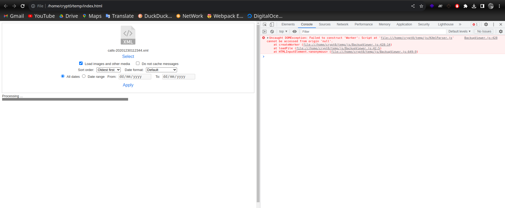
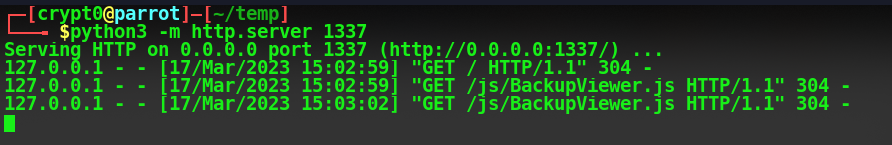
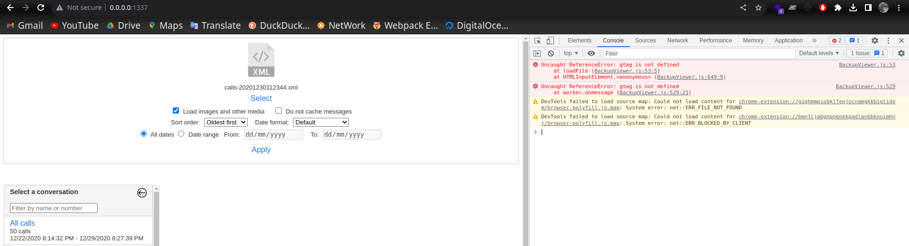

# BackUpViewer
A simple Backups Viewer website.

This was cloned (ripped) from https://synctech.com.au/view-backup/ as i was paranoid and needed to make sure my messages or call logs aren't being intercepted. I reviewed the code best i could and ensured it doesn't phone home as a privacy concern.

For backing up you can use their app on google playsore https://play.google.com/store/apps/details?id=com.riteshsahu.SMSBackupRestore&pli=1

You can still use the website but as for me am paranoid 😆.

If you run the html without a webserver you get an error about null origin 


so just run the python simple http server 

```python
python3 -m http.server 1337
```


The error should be gone now.


